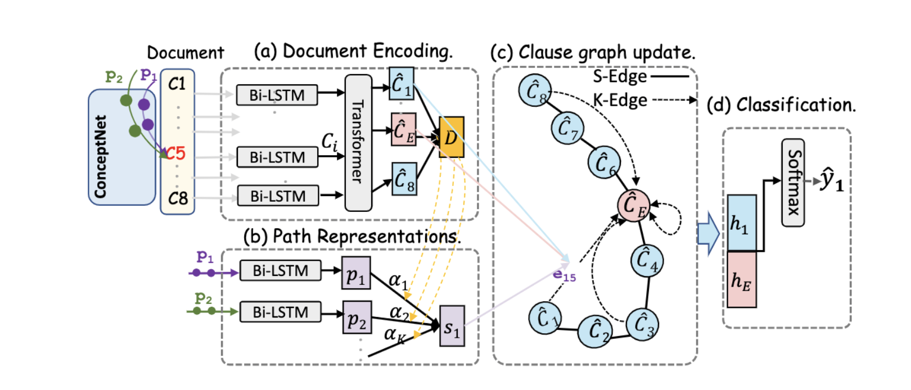

# PositionBias-in-Emotion-Cause-Analysis
ACL2021:Position Bias Mitigation: A Knowledge-Aware Graph Model for EmotionCause Extraction

[Hanqi Yan](https://github.com/hanqi-qi), [Lin Gui](https://warwick.ac.uk/fac/sci/dcs/people/lin_gui/), [Gabriele Pergola](https://warwick.ac.uk/fac/sci/dcs/people/u1898418/), [Yulan He](https://warwick.ac.uk/fac/sci/dcs/people/yulan_he/).

In this work, we find that a widely-used ECE dataset exhibits a poistion bias and existing models tend to rely on the relative information and suffer from the dataset bias. Our proposed knowledge-aware model performs on par with the existing methods on the original ECE dataset, and is more robust against adversarial samples whose relative imformation has been changed. [Our paper contains further details](https://arxiv.org/abs/2106.03518). This repository contains the code for our experiments.

<p>

</p>

## Requirements

To install a working environment: unexpected errors may occur if run in tf2.0 :( 

```
conda create --name ecause python=3.6
pip install tensorflow-gpu==1.9.0
conda activate ecause
```

## Code Structure

This repo contains three parts to reproduce our experiments, i.e., extract knowledge paths from the ConceptNet in [path_extract repository](path_extract), incorporat the knowledge paths to capturing the causal relations between the document clauses in [main.py](main.py), generate adversarial samples and evaluate existing ECE models on these sampels in [ad_paedgl.py](ad_paedgl.py). 

### Path Extraction
We first extract knowledeg paths which contain less than two intermediate entities from ConceptNet. [KagNet](https://github.com/INK-USC/KagNet) contains the driver code to extract all the knowledge paths between the given head entity and the tail entity. Our code provides how to identity the keywords as the head/tail entity, and the path filter mechanism in [filter_path.py](path_extract/filter_path.py).

### Knowledge-aware graph model
This part use the extracted paths to identity the cause clauses in a document.
```
python main.py
```
To see the model performances with absolute position rather than the relative position, modify the input data in [model_funcs.py](utils/model_funcs.py).
### Adversarial Attacks
This part genetrate the adversarial samples, which swap two clauses to disturb the original relative position information. Then we observe performances drops in exsiting ECE models. Use PAEDGL model as an example.
```
python ad_paedgl.py
```

## Citation

If you find our work useful, please cite as:

```
@misc{yan2021position,
      title={Position Bias Mitigation: A Knowledge-Aware Graph Model for Emotion Cause Extraction}, 
      author={Hanqi Yan and Lin Gui and Gabriele Pergola and Yulan He},
      year={2021},
      eprint={2106.03518},
      archivePrefix={arXiv},
      primaryClass={cs.CL}
}
```
